# Witsoc Flow — the enforced campaign loop

This flowchart IS the top-level witsoc state machine (one source of truth:
`scripts/flow_spec.py`; the controller gates the UseSkill path with the same
graph — do not edit this file by hand, regenerate it). All doctrine still
applies at every node: statuses only via the claim-acceptance contract, WIT
before Lean, kernel receipts as the only VERIFIED_LEAN, honest stops are
results.

```mermaid
flowchart TD
    intake["Read runs/current_flow_target.json (write it first if missing: the exact task). Freeze the target: statement, quantifiers, domains, hypotheses, definitions, freeze hashes. Run fuel autowire and state the fuel banner. Never silently strengthen or weaken the statement."]
    explorer_triage["Explorer triage per witsoc-explorer/SKILL.md: classify status with sources, run scripts/falsification_battery.py against the frozen target, run the autoform-vote target gate, select premises (pool, Herald, atlas+Loogle). Then choose: generator_ready (solved/routine/formalizable), needs_research (open/unsolved/blocked -> write the Lovasz barrier packet), or under_specified (ambiguity that must go back to the requester)."]
    lovasz_campaign["Run the Lovasz gated phase machine (witsoc-research-lovasz/SKILL.md): audit packet, triage, disproof-first, proof-DAG, budget-gate check (scripts/campaign_budget_gate.py check — respect its tier recommendation), dispatch via scripts/dispatch_prompts.py (foreground probes in one message; background workers within cap; keep the disproof lane running), score, skeptic, synthesis audit, then write explorer_return_packet.json."]
    explorer_review["Explorer reviews the Lovasz return mechanically (scripts/validate_lovasz_return.py first — a failing return is rejected back). Choose exactly one: lovasz_again (new one-axis-mutated barrier packet), generator_ready (a verified narrow product is WIT-ready), demote (record honest status), or honest_stop (no defensible path; record why)."]
    generator["Generator converts the accepted handoff into artifacts per witsoc-generator/SKILL.md: validate handoff, dedicated worktree, obligation graph, WIT, check+audit, optional Lean via the shared REPL for iteration and one final lake build + SafeVerify. Harvest every kernel-verified proof (services/proof_harvest)."]
    production_gates["Run the production gates: generator_receipt_gate (add --remote when the backend has E2B), fidelity record present, target-freeze hashes match, artifacts registered. Choose: pass, artifact_repair (structural/Lean friction -> Generator), or mathematical_barrier (a genuine barrier -> new Lovasz packet via Explorer)."]
    report["Write the honest final report: exact status per the claim-acceptance contract, receipts/artifacts listed, remaining gaps, next narrow action. Sync ledgers; harvest the run (lemma pool); update failure memory. An honest OPEN_UNFALSIFIED or FAILED_ATTEMPT is a valid outcome."]
    BEGIN --> intake
    intake --> explorer_triage
    explorer_triage -->|generator_ready| generator
    explorer_triage -->|needs_research| lovasz_campaign
    explorer_triage -->|under_specified| report
    lovasz_campaign --> explorer_review
    explorer_review -->|lovasz_again| lovasz_campaign
    explorer_review -->|generator_ready| generator
    explorer_review -->|demote| report
    explorer_review -->|honest_stop| report
    generator --> production_gates
    production_gates -->|pass| report
    production_gates -->|artifact_repair| generator
    production_gates -->|mathematical_barrier| lovasz_campaign
    report --> END
```

